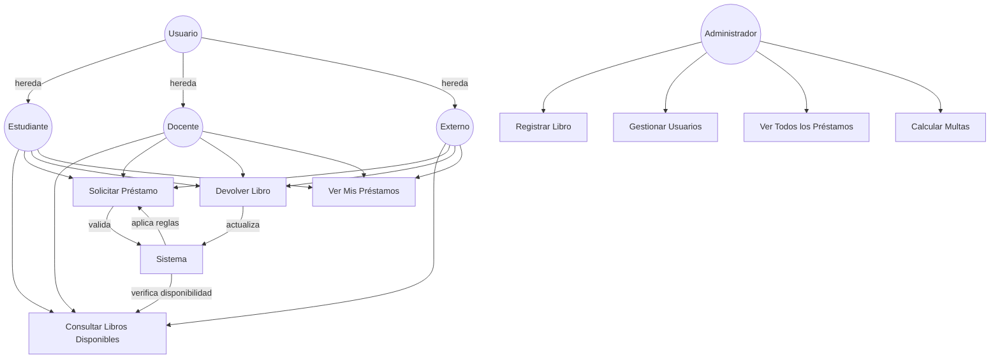
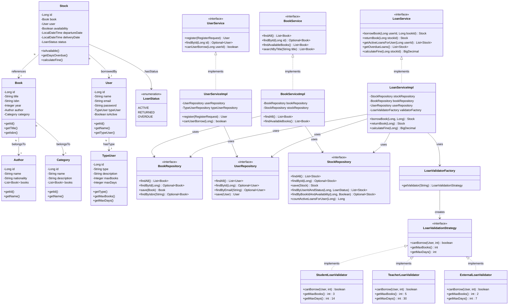

# BiblioDigit API 📚

API REST para gestión de biblioteca digital construida con Spring Boot 3.4.1 y PostgreSQL.

## 🚀 Tecnologías

- **Java 21**
- **Spring Boot 3.4.1**
  - Spring Web
  - Spring Data JPA
  - Hibernate
- **PostgreSQL 16**
- **Gradle 9.2.0**
- **Docker & Docker Compose**
- **Lombok**

## 📋 Requisitos Previos

- Docker 20.10+
- Docker Compose 2.0+
- Java 21 (solo para desarrollo local)
- Gradle 9.2+ (opcional, se usa wrapper)


## Diagramas 

### Diagrama de Caso de Uso



### Diagrama de Clases




## 🛠️ Instalación y Configuración

### 1. Clonar el Repositorio

```bash
git clone <url-del-repositorio>
cd bibliodigit
```

### 2. Configurar Variables de Entorno

Crea un archivo `.env` en la raíz del proyecto:

```env
# Base de Datos PostgreSQL
DB_NAME=bibliodigit
DB_USER=postgres
DB_PASSWORD=tu_password_seguro
DB_URL=jdbc:postgresql://db:5432/bibliodigit
```

### 3. Estructura del Proyecto

```
bibliodigit/
├── src/
│   ├── main/
│   │   ├── java/org/bibliodigit/
│   │   │   ├── App.java                      # Clase principal
│   │   │   ├── api/                          # Controladores REST
│   │   │   │   ├── dto/                      # Data Transfer Objects
│   │   │   │   │  ├── req/                   
│   │   │   │   │  └── res/
│   │   │   │   ├── exception/                # Manejo de excepciones
│   │   │   │   └── mapper/                   # Mappers
│   │   │   ├── application/                  # Casos de uso
│   │   │   │   └── service/
│   │   │   ├── domain/                       # Entidades de dominio
│   │   │   │   └── port/                     # Interfaces de servicios
│   │   │   └── repository/                   # Repositorios JPA
│   │   └── resources/
│   │       └── application.properties
│   └── test/
│       ├─── java/org/bibliodigit/
│       │    ├── api/ 
│       │    ├── application/
│       │    │   └── service/
│       │    ├── integration/
│       │    └── repository/
│       └── resources/
│           └── application-test.properties
├── docker-compose.yml
├── Dockerfile
├── build.gradle.kts
├── settings.gradle.kts
├── gradle/
│   └── libs.versions.toml
└── .env
```

## 🐳 Ejecución con Docker

### Opción 1: Modo Producción (Recomendado)

Ejecuta la aplicación completa en contenedores:

```bash
# Construir y ejecutar
docker-compose up --build

# Ejecutar en segundo plano
docker-compose up --build -d

# Ver logs
docker-compose logs -f app-service

# Detener
docker-compose down
```

La aplicación estará disponible en: **http://localhost:8080**

Y para los test el siguiente commando
```bash
docker build --target test --no-cache -t bibliodigit-test:latest .
```

### Opción 2: Reconstruir después de cambios

Cuando hagas cambios en el código:

```bash
# Detener, reconstruir y reiniciar
docker-compose down && docker-compose up --build
```

## 💻 Ejecución en Modo Desarrollo

Para desarrollo activo con **hot reload**:

### 1. Levantar solo PostgreSQL

```bash
docker-compose up db
```

### 2. Ejecutar la aplicación localmente

En otra terminal:

```bash
# Con Gradle Wrapper (recomendado)
./gradlew bootRun

# O con Gradle instalado
gradle bootRun
```

### 3. Ejecutar tests

```bash
# Todos los tests
./gradlew test

# Tests con reporte detallado
./gradlew test --info

# Limpiar y construir
./gradlew clean build
```

## 📡 Endpoints de la API

### Health Check

```http
GET http://localhost:8080/api/health
```

**Respuesta:**
```json
{
  "status": "UP",
  "service": "BiblioDigit API",
  "version": "1.0.2"
}
```


### Book API`s
#### CRUD:
```http
POST   /api/books                    # Crear libro
GET    /api/books                    # Listar todos
GET    /api/books/{id}               # Obtener por ID
PUT    /api/books/{id}               # Actualizar
DELETE /api/books/{id}               # Eliminar
```

#### Búsquedas
```http
GET /api/books/search/title?keyword=clean
GET /api/books/author/{authorId}
GET /api/books/search/author?name=tolkien
GET /api/books/category/{categoryId}
GET /api/books/search/category?name=Fiction
GET /api/books/year/2020
GET /api/books/year-range?start=2000&end=2020
```
### Estadísticas
```http
GET /api/books/count/author/{authorId}
GET /api/books/count/category/{categoryId}
GET /api/books/exists?title=Clean Code
```
## 🗄️ Base de Datos

### Conexión Directa a PostgreSQL

```bash
# Desde el contenedor
docker exec -it bibilio_db psql -U postgres -d bibliodigit

# Desde tu máquina (si tienes psql instalado)
psql -h localhost -p 5432 -U postgres -d bibliodigit
```

### Comandos SQL útiles

```sql
-- Listar tablas
\dt

-- Ver estructura de tabla books
\d books

-- Consultar libros
SELECT * FROM books;

-- Salir
\q
```

## 🧪 Testing

### Ejecutar Tests

```bash
# Todos los tests
./gradlew test

# Tests específicos
./gradlew test --tests "AppTest"

# Con coverage
./gradlew test jacocoTestReport
```

Los tests usan **H2 en memoria**, no afectan la base de datos de desarrollo.

## 📦 Construcción del JAR

```bash
# Construir JAR ejecutable
./gradlew bootJar

# El JAR se genera en:
# app/build/libs/app.jar
```

## 🔧 Troubleshooting

### Error: Puerto 8080 ya en uso

```bash
# Encontrar el proceso
lsof -i :8080

# Matar el proceso
kill -9 <PID>

# O cambiar el puerto en application.properties
server.port=8081
```

### Error: Puerto 5432 ya en uso (PostgreSQL)

```bash
# Detener PostgreSQL local
sudo systemctl stop postgresql

# O cambiar el puerto en docker-compose.yml
ports:
  - "5433:5432"  # Usar 5433 en lugar de 5432
```

### Error: Cannot connect to Docker daemon

```bash
# Iniciar Docker
sudo systemctl start docker

# Verificar estado
sudo systemctl status docker
```

### Limpiar todo Docker

```bash
# Detener y eliminar contenedores
docker-compose down

# Eliminar volúmenes (¡CUIDADO! Elimina datos)
docker-compose down -v

# Eliminar imágenes
docker rmi bibiliodigit:latest

# Reconstruir desde cero
docker-compose up --build
```

## 📊 Monitoreo

### Ver logs en tiempo real

```bash
# Todos los servicios
docker-compose logs -f

# Solo la aplicación
docker-compose logs -f app-service

# Solo la base de datos
docker-compose logs -f db
```

### Estado de los contenedores

```bash
# Ver contenedores corriendo
docker ps

# Ver todos los contenedores
docker ps -a

# Inspeccionar un contenedor
docker inspect bibilio_app
```

## 🚀 Despliegue

### Variables de Entorno de Producción

```env
# Producción
DB_NAME=bibliodigit_prod
DB_USER=bibliodigit_user
DB_PASSWORD=<c
